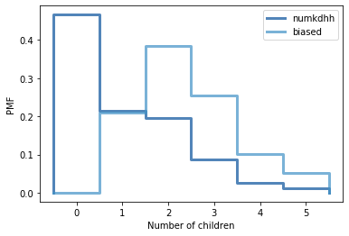

[Think Stats Chapter 3 Exercise 1](http://greenteapress.com/thinkstats2/html/thinkstats2004.html#toc31) (actual vs. biased)

# Homework Question

This problem presents a robust example of actual vs biased data. As a data scientist, it will be important to examine not only the data that is available, but also the data that may be missing but highly relevant. You will see how the absence of this relevant data will bias a dataset, its distribution, and ultimately, its statistical interpretation.

# Textbook Question

Something like the class size paradox appears if you survey children and ask how many children are in their family. Families with many children are more likely to appear in your sample, and families with no children have no chance to be in the sample. 

Use the NSFG respondent variable NUMKDHH to construct the actual distribution for the number of children under 18 in the household. 

Now compute the biased distribution we would see if we surveyed the children and asked them how many children under 18 (including themselves) are in their household. 

Plot the actual and biased distributions, and compute their means. As a starting place, you can use chap03ex.ipynb.

# Solution

As shown in the plot below, the biased sample will have zero respondents that have zero children (as 0 * x = 0). This sampling also removes the effect of large families skewing the mean to the right. In other words, the average family has around one child, not more than two.

```
resp = nsfg.ReadFemResp()
pmf = thinkstats2.Pmf(resp.numkdhh, label='numkdhh')
biased = BiasPmf(pmf, label='biased')
thinkplot.PrePlot(2)
thinkplot.Pmfs([pmf, biased])
thinkplot.Config(xlabel='Number of children', ylabel='PMF')
```



```
> [pmf.Mean(), biased.Mean()]
[1.024205155043831, 2.403679100664282]
```