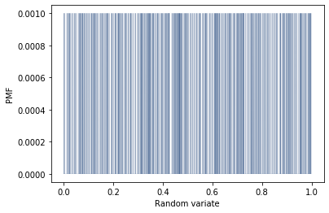
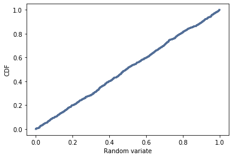

[Think Stats Chapter 4 Exercise 2](http://greenteapress.com/thinkstats2/html/thinkstats2005.html#toc41) (a random distribution)

# Homework Question

This questions asks you to examine the function that produces random numbers. Is it really random? A good way to test that is to examine the pmf and cdf of the list of random numbers and visualize the distribution. If you’re not sure what pmf is, read more about it in Chapter 3.

# Textbook Question

The numbers generated by random.random are supposed to be uniform between 0 and 1; that is, every value in the range should have the same probability. 

Generate 1000 numbers from random.random and plot their PMF and CDF. Is the distribution uniform?

# Solution

The goal of this number was to show np.random.random is pseudo-random, approximately distributed uniformly across the range [0, 1). This is supported by the PDF and CDF. For reference, as N -> infinity, the PDF would be a solid blue rectangle from 0 to 1 with a height of approximately 1/N.

The CDF is clearer to read in this context. Its trendline would be straight line from (0,0) to (1,1) – as is the case.

```
t = np.random.random(1000)
pmf = thinkstats2.Pmf(t)
thinkplot.Pmf(pmf, linewidth=0.1)
thinkplot.Config(xlabel='Random variate', ylabel='PMF')
```



```
cdf = thinkstats2.Cdf(t)
thinkplot.Cdf(cdf)
thinkplot.Config(xlabel='Random variate', ylabel='CDF')
```

